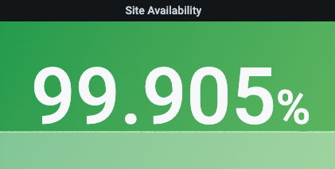

# Project Name
Klarna assessment

## Goal
* Create an user interface to perform 3 tasks of sum fibonacci, factorial, and ackermann
* Have a web service 
* Collect relative metrics and logs
* have a dashboard for monitoring
## Architecture
```
Load Balancer: Nginx
Web Server: flask
Language: Python
Log collection: filebeat
Uptime monitoring: elastic-heartbeat
Metrics datastore: Elasticsearch
Visualization: Kibana/Grafana
Docker for orchestration
```

## Usage
To bring up all the services at once, run the command below for the fist time and only run `docker-compose up` after
```
docker-compose up --build
```

To only startup the flask web: 
```
bash start.sh
```

## Endpoints
```
Web:
    - Main page: http://localhost:8080/
    - Fibonacci endpoint: http://localhost:8080/tasks/fibonacci
    - ackermann: http://localhost:8080/tasks/ackermann
    - factorial: http://localhost:8080/tasks/factorial

Visualization:
    grafana login: admin/123456
    grafana dashboard: http://localhost:3000/d/9o2OM3R7z/klarna-demo?orgId=1

    kibana: http://localhost:5601/app/uptime
    logs: http://localhost:5601/goto/f3f46861569d64331f9331aa99398e12


```

## Monitoring
Level 1: 
    - site uptime - measure from nginx endpoint to ensure the overall uptime
  
Level 2: 
    - site availability rate . 
    Not be able to done it here. formula ( total requests - "5xx errors")/ (total requests)

Level 3:
    - site latency - measure from nginx and use it as an indicator of overall site performnace

others:
    - response
    - top hit routes
    - count of each http status
    - service performance


## What can we done better
Application
    - application logs
    - Application performance management tool integration

Architecture
    - queue system for logs and metrics
    - central logging endpoint

Depends
    - depends on the use case, we will use different solution


## Alerting
Dont have alerting yet. We can simply use grafana alerting to create monitor on top of those graphs. But grafana alerting is not highly recommend (very limited)

## Incident management
Pagerduty to distribute the alert to the support owner by schedule

## Anomaly detection
Implement anomaly detection mechanism to auto generate alert when the bad behaviour detected

